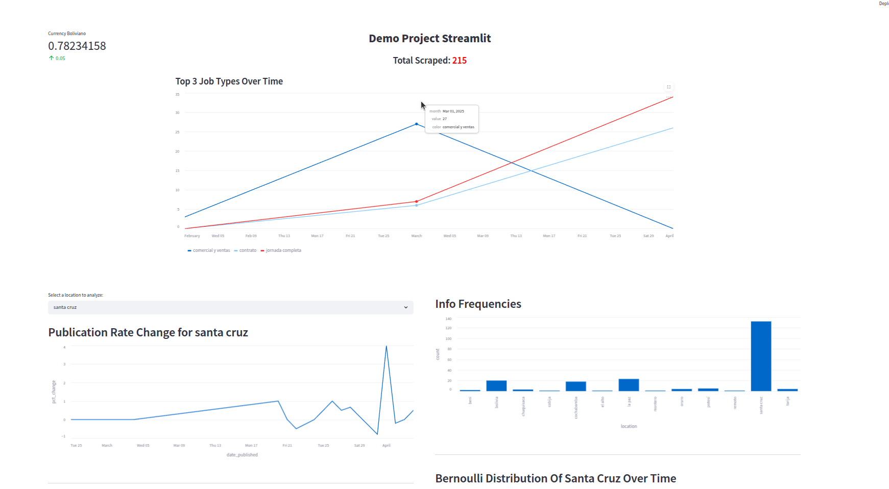
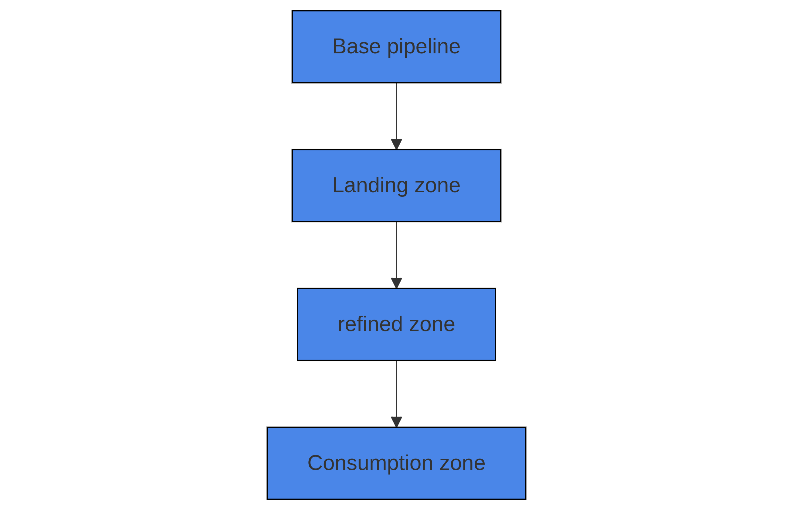

# ETL Project with Scrapy: Template Documentation  

 ## Índice 

- [Requirements](#requirements)
- [Installation](#installation)
- [Quick Start](#quick-start)
- [Usage](#usage)
- [Architecture](#architecture)
- [Configuration](#configuration)
- [Roadmap](#roadmap)
- [Authors](#authors)
- [License](#license)
- [Acknowledgements](#acknowledgements)

## Descripción
 
El Job Collector scraper es un bot que busca en internet nuevos empleos disponibles y los guarda localmente en un formato específico.
Actualmente puede buscar en dos sitios web de Bolivia que son:
- Trabajando.com.bo/ 
- Trabajito.com.bo/

Es seguido con una plantilla de tablero hecha con streamlit que puede ser modificada para adaptarse a cualquier necesidad. 

### Dashboard picture


### Estructura ETL  


-- Podemos añadir más detalles --

## Requisitos 

Para instalar y ejecutar eficazmente el bot, el sistema necesita tener previamente instalado 
 
- Python 3+
- PostgreSQL 


## Instalación 

El archivo consta de dos partes. La carpeta del cuadro de mandos y el proyecto ETL, que representan un sistema fullstack. 

El primer paso es crear un entorno virtual e instalar todas las dependencias necesarias para ejecutar el proyecto.


```bash
python3 -m venv env
source env/bin/activate
pip install -r requirements.txt 

```

## Ejecutar el sistema ETL 

Para ejecutar el sistema ETL, podemos seguir estos comandos en el terminal: 


```python
# run the code 
(env) usr@usr: scrapy runspider trabajando.py
```

Esto ejecutará el bot que extraerá los datos de las dos fuentes, los procesará (limpiará y transformará a través de los pipelines), Luego guardará los 
conjuntos de datos en la arquitectura datalake (imagen superior).

Sólo los datos refinados y de consumo tendrán una duplicación en la Base de Datos (PostgresSQL) los datos en bruto, sólo caerán en la zona de aterrizaje como archivos json.

## Utilización 

El panel de control de plantillas ofrece varias formas de utilizar los datos. Podemos construir un cuadro de mando completo para analizar las tendencias del empleo en Bolivia o en Sudamérica al agregar más 
fuentes. Los bots también pueden utilizarse para entrenar modelos de predicción de competencias en relación con empleos específicos. 

Aquí el objetivo era aprender desde cero a configurar y construir un sistema etl con un dashboard que proporcione información sobre los datos para entenderlos mejor de forma automática.


## Arquitectura
 
Explique el diseño de alto nivel y los componentes de su proyecto.


├── dashboard
│   ├── __init__.py
│   ├── __pycache__
│   │   └── utils.cpython-311.pyc
│   ├── secrets.toml
│   └── viz.py
├── dashboard.png
├── README.md
├── scrapy.cfg
├── structure.png
└── trabajando
    ├── __init__.py
    ├── items.py
    ├── middlewares.py
    ├── pipelines
    │   ├── base_pipeline.py
    │   ├── consumption_pipeline.py
    │   ├── __init__.py
    │   ├── landing_pipeline.py
    │   ├── __pycache__
    │   │   ├── base_pipeline.cpython-311.pyc
    │   │   ├── consumption_pipeline.cpython-311.pyc
    │   │   ├── __init__.cpython-311.pyc
    │   │   ├── landing_pipeline.cpython-311.pyc
    │   │   ├── pipelines.cpython-311.pyc
    │   │   └── refined_pipeline.cpython-311.pyc
    │   └── refined_pipeline.py
    ├── __pycache__
    │   ├── __init__.cpython-311.pyc
    │   ├── items.cpython-311.pyc
    │   ├── pipelines.cpython-311.pyc
    │   └── settings.cpython-311.pyc
    ├── settings.py
    ├── spiders
    │   ├── datalake
    │   │   ├── consumption
    │   │   ├── landing
    │   │   └── refined
    │   ├── data_web.py
    │   ├── demo_hoy.json
    │   ├── __init__.py
    │   ├── __pycache__
    │   │   ├── data_web.cpython-311.pyc
    │   │   ├── __init__.cpython-311.pyc
    │   │   └── trabajando_demo.cpython-311.pyc
    │   └── trabajando_demo.py


## Configuración 

Los datos se guardan como json en tres carpetas diferentes en función de su calidad: 

- Aterrizaje 
- Refinado
- Consumo

Cada una de ellas ofrece distintos niveles de calidad para manipular los datos, mientras que la zona de aterrizaje proporciona los datos en bruto.

```json
{
  "url": "trabajando.com.bo/trabajo/vendedor",
  "title": "vendedor",
  "location": "la paz",
  "type_job": 'tiempo partial',
  ...
}
```

## Roadmap

## Versioning

## Authors

*Initial work* - [anvialex](https://github.com/anvix9)

## License

Este proyecto está licenciado bajo la licencia MIT [LICENSE](https://choosealicense.com/licenses/mit/).

## Acknowledgements

*
